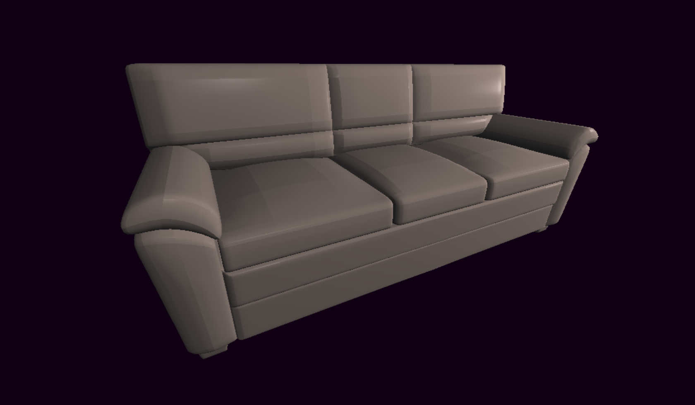

# SlowRenderer
CPU rendering

### Microsoft Visual Studio Windows桌面应用程序 C++20

 ## 效果图

 ## 演示视频
 https://www.bilibili.com/video/BV1XQ4y1L7Qk/?vd_source=6d48c8dce1e2a6f3b5318760f3511c93#reply708398682

## 技术点
- 向量和矩阵计算库；
- 线程池并行；
- 多边形裁剪与直线绘制；
- 背面剔除；
- 半平面交渲染三角形；
- 深度缓冲、修正属性插值；
- Blinn-Phong光照模型；